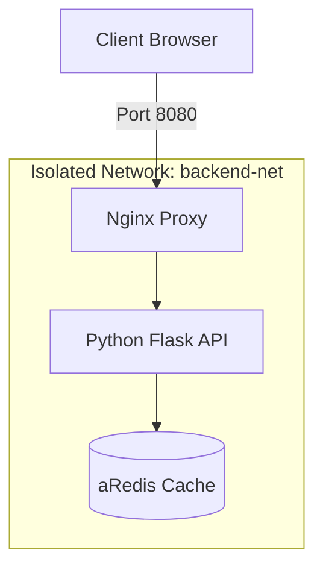

# Modul 03: Multi-Container Production Architecture

## 1. Konsep & Arsitektur
Arsitektur microservices terisolasi memisahkan Nginx Reverse Proxy, Python Flask API (Non-root user), dan Redis Cache Engine.

2# 2. Diagram Topologi Arsitektur (Mermaid)

